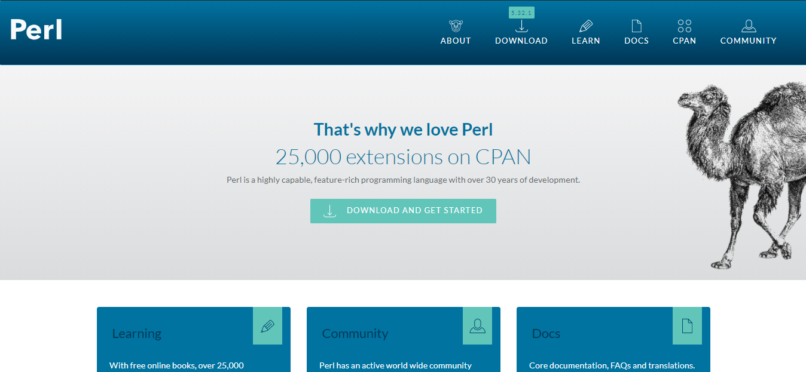

<h2 align="center">  Power of Perl -🐫 Learn Basic and Advanced Perl </h2>
<!-- https://shields.io/ -->

<p align="center">
  
  </a>
    
  </a>
  <a href="https://github.com/BrianMarquez3/Perl-Course/stargazers">
    
  </a>
  <a href="https://github.com/BrianMarquez3/Perl-Course/network">
    
  </a>
    
  </a>
  </a>
    
  </a>
  </a>
    
  </a>
  </a>
   <a href="https://github.com/BrianMarquez3/Perl-Course/network">
    
  </a><br>
  
  
</P>

<table align="center">
  <tr>
    <td align="center" style="padding=0;width=50%;">
      
    </td>
  </tr>
</table>

## Table of Contents

| Numeration   | Check  |    Topic      |   Quantization   |    Edit Gitpot    |    Downloads    |  link  |
| ------------ |--------|-------------- |----------------- |------------------ |---------------- |-------- |
|  001   |:heavy_check_mark: | [Creador](#Creador)   | 🐫    | 💻 | 💾 | [ ⬅️ back](https://github.com/BrianMarquez3)| 
|  002   |:heavy_check_mark: | [Perl](#Perl)   | 🐫    | 💻 | 💾 | [ ⬅️ back](https://github.com/BrianMarquez3)| 
|  003   |:heavy_check_mark: | [Instalacion](#Instalation)   | 🐫    | 💻 | 💾 | [ ⬅️ back](https://github.com/BrianMarquez3)|
|  004   |:heavy_check_mark: | [Hola Perl](#Hola-Perl)   | 🐫    | 💻 | 💾 | [ ⬅️ back](https://github.com/BrianMarquez3)| 
|  004   |:heavy_check_mark: | [Variables](#Variables)   | 🐫    | 💻 | 💾 | [ ⬅️ back](https://github.com/BrianMarquez3)| 
|  005   |:heavy_check_mark: | [Array](#Array)   | 🐫    | 💻 | 💾 | [ ⬅️ back](https://github.com/BrianMarquez3)| 
|  006   |:heavy_check_mark: | [Hashes](#Hashes)   | 🐫    | 💻 | 💾 | [ ⬅️ back](https://github.com/BrianMarquez3)| 
|  007   |:heavy_check_mark: | [Condicionales](#Condicionales)   | 🐫    | 💻 | 💾 | [ ⬅️ back](https://github.com/BrianMarquez3)| 

---

## Creador

<table align="center">
<h3 align="center"> Larry Wall  </h3>
  <tr>
    <td align="center" style="padding=0;width=50%;">
      
    </td>
  </tr>
  <h3 align="center"> Extensiones: comunes	pl y pm  </h3>
</table>


<p>Larry Wall (Los Ángeles, 27 de septiembre de 1954) es un programador y escritor, más conocido por su creación del lenguaje de programación Perl en 1987.</p>


<p>Consiguió su licenciatura en la Universidad Seattle Pacific en 1976.

Mientras hacía su posgrado en UC Berkeley, Wall y su mujer estudiaron lingüística con la intención ulterior de encontrar un lenguaje no escrito, quizás en África, y crear un sistema de escritura para él. Utilizarían este nuevo sistema de escritura para traducir varios textos en ese lenguaje, entre ellos, la Biblia. Debido a razones de salud estos planes fueron cancelados, y se quedaron en los EE. UU., donde Larry entró a trabajar en el Jet Propulsion Laboratory de la NASA después de acabar su posgrado.</p>

## Perl

<table align="center">
  <tr>
    <td align="center" style="padding=0;width=50%;">
      
    </td>
  </tr>
  <h3 align="center"> Paradigma: 	multiparadigma, funcional, imperativa, orientado a objetos (basado en clases), reflexiva, procedural, eventos, genérica  </h3>

</table>


<p>Perl es un lenguaje de programación diseñado por Larry Wall en 1987. Perl toma características del lenguaje C, del lenguaje interpretado bourne shell (sh), AWK, sed, Lisp y, en un grado inferior, de muchos otros lenguajes de programación.

Estructuralmente, Perl está basado en un estilo de bloques como los del C o AWK, y fue ampliamente adoptado por su destreza en el procesado de texto y no tener ninguna de las limitaciones de los otros lenguajes de script.</p>

[https://www.perl.org/]
[https://dev.perl.org/perl5/]

## Instalation

<table align="center">
  <tr>
    <td align="center" style="padding=0;width=50%;">
      
    </td>
  </tr>
  <h3 align="center"> Apareció en	18 de diciembre de 1987   </h3>
</table>

📦 [Install Perl 5](https://www.perl.org/get.html) get the installer for windows<br>
📦 [Install strawberry Perl](https://strawberryperl.com/) get the installer for windows Strawberry Perl<br>

Perl is a programming language suitable for writing simple scripts as well as complex applications - see [https://www.perl.org.](https://www.perl.org.)

Variables
Array
Hashes
Condicionales

## Hola Perl

| File                       | Numeration  | Link        |    Folk     |  Code       | Version     | State       | Download    |  Go back    |
|----------------------------|:-----------:|:-----------:|:-----------:|:-----------:|:-----------:|:-----------:|:-----------:|:-----------:|
| [Hola Perl](https://github.com/BrianMarquez3/Perl-Course/tree/main/001%20PrimerScript)  | 003 | ✔️  | ✔️ | yes | yes | ✔️ | 💾 | [⬅️Atras](#Tabla-de-contenidos)

## Variables

<p>Los valores numéricos espresados literalmente se presentan en forma de valores reales codificados en doble precisión. Este formato interno se utiliza para todas las operaciones aritméticas. Por ejemplo:</p>

```perl
$x = 0.897;          # un real
$y = 6.23e-24;       # un real
$n = 567;            # un entero
$i = -234;           # un entero
```
<p>Las cadenas de caracteres se especifican literalmente por medio de un sucesión de caracteres delimitada por comillas ("..") o apóstrofes ('..'). </p>

```perl
$wld = "mundo";
$str = "¡Hola $wld!";
```

| File                       | Numeration  | Link        |    Folk     |  Code       | Version     | State       | Download    |  Go back    |
|----------------------------|:-----------:|:-----------:|:-----------:|:-----------:|:-----------:|:-----------:|:-----------:|:-----------:|
| [Variables](https://github.com/BrianMarquez3/Perl-Course/tree/main/002%20Variables)  | 003 | ✔️  | ✔️ | yes | yes | ✔️ | 💾 | [⬅️Atras](#Tabla-de-contenidos)

## Array

<p>Un array es una lista de datos de tipo escalar. Cada elemento de la lista es una variable escalar a la que se le asocia un valor. Las variables de tipo array se identifican por el prefijo arroba @. Por ejemplo:</p>

```perl
@numeros = (2, 1, 667, 23, 2.2, 5, 6);
@letras = ("perro", "gato", "león");
@mezcla = ("hola", 23, "adios", 31.234);
```

También se puede  acceder a un array mediante el operador que define una horquilla de índices. Por ejemplo:

```perl
@num1 = @numeros[1..3];     # @num1 = (1, 667, 23)
@str = @letras[0,2];        # @str = ("perro", "león")
($ristra, $num) = @mezcla;  # $ristra = "hola", $num = 23
```

| File                       | Numeration  | Link        |    Folk     |  Code       | Version     | State       | Download    |  Go back    |
|----------------------------|:-----------:|:-----------:|:-----------:|:-----------:|:-----------:|:-----------:|:-----------:|:-----------:|
| [Array](https://github.com/BrianMarquez3/Perl-Course/tree/main/003%20Arrays)  | 003 | ✔️  | ✔️ | yes | yes | ✔️ | 💾 | [⬅️Atras](#Tabla-de-contenidos)

## Hashes

```perl
#!/usr/bin/perl

%data = ('John Paul', 45, 'Lisa', 30, 'Kumar', 40);

print "\$data{'John Paul'} = $data{'John Paul'}\n";
print "\$data{'Lisa'} = $data{'Lisa'}\n";
print "\$data{'Kumar'} = $data{'Kumar'}\n";
```


| File                       | Numeration  | Link        |    Folk     |  Code       | Version     | State       | Download    |  Go back    |
|----------------------------|:-----------:|:-----------:|:-----------:|:-----------:|:-----------:|:-----------:|:-----------:|:-----------:|
| [Hashes](https://github.com/BrianMarquez3/Perl-Course/tree/main/004%20Hashes)  | 003 | ✔️  | ✔️ | yes | yes | ✔️ | 💾 | [⬅️Atras](#Tabla-de-contenidos)

## Condicionales

| File                       | Numeration  | Link        |    Folk     |  Code       | Version     | State       | Download    |  Go back    |
|----------------------------|:-----------:|:-----------:|:-----------:|:-----------:|:-----------:|:-----------:|:-----------:|:-----------:|
| [Condicionales](https://github.com/BrianMarquez3/Perl-Course/tree/main/005%20Condicionales)  | 003 | ✔️  | ✔️ | yes | yes | ✔️ | 💾 | [⬅️Atras](#Tabla-de-contenidos)


----

## Paypal Donation
🩸 Hacer una donación [PAYPAL](https://www.paypal.com/donate?hosted_button_id=98U3T62494H9Y) 🍵

## License 
Todo acerca de la licencia [here](https://github.com/BrianMarquez3/Learning-Git/blob/master/LICENCE)

<table>
  <tr>
    <td align="center" style="padding=0;width=50%;">
      
    </td>
  </tr>
</table>